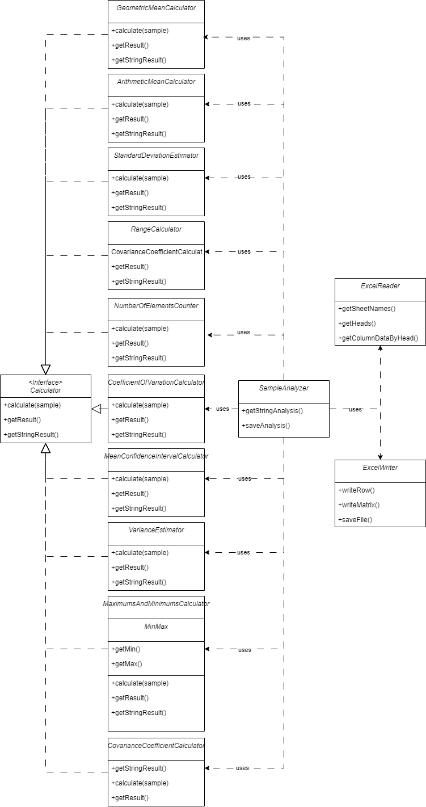

# SampleAnalyzer

## Описание

SampleAnalyzer - это инструмент для анализа выборок случайных чисел. Программа позволяет загружать данные из файлов Excel и выполнять статистический анализ для каждой выборки.

## Статистические параметры, рассчитываемые SampleAnalyzer

- Среднее геометрическое для каждой выборки
- Среднее арифметическое для каждой выборки
- Оценка стандартного отклонения для каждой выборки
- Размах каждой выборки
- Коэффициенты ковариации для всех пар случайных чисел
- Количество элементов в каждой выборке
- Коэффициент вариации для каждой выборки
- Доверительный интервал для математического ожидания (при условии, что случайные числа подчиняются нормальному закону распределения)
- Оценка дисперсии для каждой выборки
- Максимумы и минимумы для каждой выборки

## Требования

- JDK 20 или более поздняя версия

## Запуск

1. Установите JDK 20 или более позднюю версию, если она не установлена.
2. Скачайте и распакуйте проект SampleAnalyzer.
3. Запустите программу, используя команду `java -jar lab2_4.jar`.

## Использование

1. Запустите приложение.
2. Нажмите кнопку "Выбрать файл" и выберите файл Excel (.xlsx), содержащий данные для анализа.
3. Выберите лист и выборку для анализа.
4. Нажмите кнопку "Рассчитать" для выполнения анализа.
5. Результаты анализа будут отображены на экране.
6. При необходимости можно экспортировать результаты анализа в файл, нажав кнопку "Экспортировать".

## Структура проекта

### Основные компоненты

- **Window**: Главный класс приложения, отвечает за отображение основного окна, загрузку данных и выполнение анализа.
- **SampleAnalyzer**: Класс, предоставляющий методы для выполнения статистического анализа данных.

### Схема проекта (UML)

